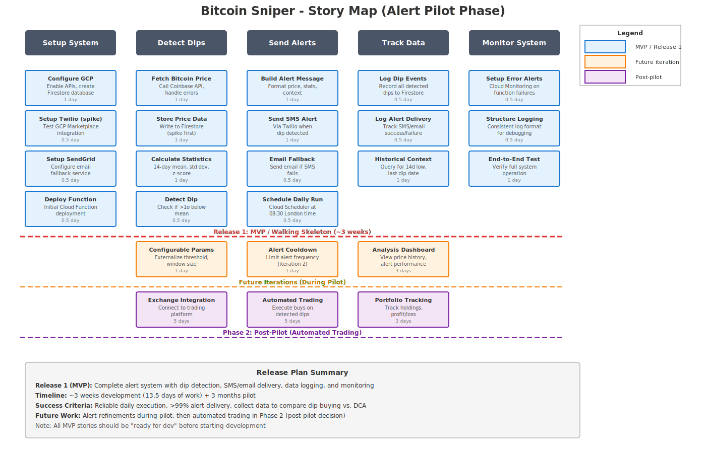

# Using Github Copilot for product management and business analysis

---

&gt; read instructions.md and tell me what you think
we are going to do

We're going to demonstrate using GitHub Copilot for product management and business analysis work, developing a hypothetical product from vision through user stories without actual implementation.

---

&gt; read the product vision I have supplied

Got it! You're building "Bitcoin Sniper" - a tool to detect periodic dips in Bitcoin prices and alert you (or eventually auto-buy) when there's a favourable buying opportunity. It's a personal project for one user (you) based on the hypothesis that Bitcoin price patterns are somewhat periodic. Starting with alerts before moving to automated trading

---

&gt; what research questions would you have at this time? Write them to a document

---

&gt; I've added a csv file of daily bitcoin prices to the data folder. See if you can have a go at answering the first few research questions you listed under 'problem validation'. Write your findings to a file

---

&gt; I note that your research isn't convinced about the financial viability of this. But as the project is for demonstration purposes we'll assume I want to proceed anyway. I've answered some of your other questions in separate research findings documents. What's your understanding now?

--

Perfect! Here's my understanding:

   Technical: Coinbase APIs available for daily Bitcoin data, which meets your needs.

   User Needs: Daily alert (weekdays only) at 8:30 AM London time via SMS (preferred) or email, showing current price and context for why it's a buying opportunity.

   Scope: Starting with an alert-only pilot for one quarter, deferring actual trading implementation and associated financial/regulatory concerns until later.

   Success Criteria: Compare notional profits from your alert-triggered buys (fixed sum per alert) against fortnightly DCA over the quarter. Success = beating DCA by a
   meaningful percentage (or losing less in a down market).

   So we're building an observation/alert system first, which is sensible—validate the hypothesis with real-time alerts before automating trades. Ready to move forward with
   defining requirements and user stories for this pilot phase?

  

---

&gt; Let's start by drafting a short, focused product requirements document. Ask me any questions you have.

--

 I'll draft a PRD for the Bitcoin Sniper alert pilot. A few questions first:

Alert frequency: If multiple days in a week trigger the dip criteria, should you receive an alert each time, or is there a cooldown period (e.g. only one alert per week)?

Dip detection method: Based on my analysis, the statistical deviation method (>1 std dev below 14-day mean) seemed most promising. Should we use that, or would you prefer the simpler >2% daily drop method?

Alert content specifics: Beyond current price and context, do you want historical comparison (e.g., "lowest in past 14 days") or forward-looking info (e.g., "similar dips recovered by X% within 7 days")?

SMS provider preference: Do you have a preference (Twilio, AWS SNS, etc.) or should I just note "SMS service TBD"?

Pilot start date: When do you plan to begin the 3-month pilot?

Out of scope clarifications: Should I explicitly list things like "no automated trading", "no portfolio tracking", "no multi-currency support" to keep scope tight?

--

&gt; Let's use your suggestions for dip detection. I think we'll try historical context for alerts. Let's leave the choice of SMS provider for our technical design document. Start date is - whenever we are shipped and ready, the exact day is not important. Those are the easy ones. On alert frequency - I suggest we think in terms of iteration here? State your out of scopes for now.

--

Done! I've created a focused PRD covering the alert pilot phase. Key points:

Alert frequency: Iteration 1 starts with no cooldown (alert every dip), with options for future iterations based on pilot learnings.

Out of scope: All trading automation, portfolio tracking, multi-user, dashboards, predictions, and customisation features—keeping this strictly about alert delivery and hypothesis validation.

Does this capture what you need, or would you like me to adjust anything?

---

&gt; Now let's think about a technical design document. Again, ask me any questions you have. One at a time might be easier.

--

Let me start with the foundational question. Hosting/deployment environment: What's your preference for where this will run? Options could include:

  - Cloud provider (AWS, Azure, GCP) with serverless functions (Lambda, Cloud Functions, etc.)
  - Cloud provider with a small always-on server/container
  - Self-hosted on your own hardware/VPS
  - Something else?

This will inform the rest of the technical architecture decisions.

--

&gt; well, I don't want to spend a lot of money on this. What's your assessment of the first two cloud options versus running it myself on something like a raspberry pi? 

--

Serverless (AWS Lambda/CloudWatch):

     - ~$0.20/month (1 execution/day, minimal compute)
     - Free tier covers this easily for first year
     - SMS via AWS SNS: ~$0.05 per message (£1.50/month for 30 alerts)
     - Total: ~£2/month after free tier expires

   Small cloud server (t2.micro/equivalent):

     - ~$5-10/month for basic instance
     - SMS costs same as above
     - Total: ~£8-12/month

   Raspberry Pi (self-hosted):

     - One-time: £35-50 for Pi, £10-15 for power supply/SD card
     - Running costs: ~£2/month electricity
     - SMS via Twilio/similar: same ~£1.50/month
     - Total: £50 upfront, then £3.50/month
     - BUT: Your internet/power reliability becomes critical, you handle all maintenance

   My recommendation: Serverless for a 3-month pilot. Minimal cost (possibly free), zero maintenance, highly reliable, and you're not locked in. If this becomes long-term, the
   Pi makes financial sense after ~18 months.

   What's your preference given the cost/effort trade-offs?

--

Data storage: For storing the price history, detected dips, and alert logs (REQ-10, REQ-11, REQ-12), what would you prefer?

Options:

  - Cloud Storage bucket with CSV/JSON files (simplest, cheapest, ~pennies/month)
  - Cloud Firestore (NoSQL, easy queries, free tier generous)
  - Cloud SQL (PostgreSQL/MySQL, more overhead but familiar if you prefer SQL)
  - BigQuery (overkill for this, but good if you want to do analysis later)

Given the small data volumes (daily entries, ~90 records over pilot), even the "expensive" options are negligible cost-wise.

-- 

&gt; I've done projects myself just with a csv in a bucket and agree the SQL options are overkill at this stage. But I'm unfamiliar with firestore

--

  Firestore quick comparison:

   CSV in Cloud Storage (your experience):

     - Read entire file, append new row, write back
     - Manual parsing/formatting
     - Risk of corruption if writes fail mid-process
     - Need to handle locking if multiple processes
     - Simple, predictable

   Firestore (NoSQL document DB):

     - Add records with single API call: db.collection('prices').add({date: ..., price: ...})
     - Query easily: "get all dips in last 30 days"
     - Atomic writes (no corruption risk)
     - Free tier: 50K reads, 20K writes, 1GB storage per day (way more than needed)
     - Cost after free tier: effectively £0 for this use case
     - Slightly more setup than CSV initially

   My take for this project: CSV is fine and you know it works. Firestore is marginally "better" but adds a learning curve you don't need for a 3-month pilot with 90 records.

   Recommendation: Stick with CSV in Cloud Storage bucket unless you want to learn Firestore for future projects?

-- 

&gt; Let's plan to spike firestore and then fall back on a csv if we don't like it

--

[Questions follow about alerting mechanisms (email/SMS) and monitoring. For example]  

Error handling and monitoring: If something goes wrong (API down, SMS fails, function crashes), how should you be notified?

   Options:

     - GCP Cloud Monitoring alerts (email you on function failures)
     - Just rely on missing the expected alert (if no SMS arrives, something went wrong)
     - Separate error notification channel (different email/SMS for system errors vs. Bitcoin alerts)
     - Logging only (check Cloud Logging manually if curious)

   Given this is monitoring Bitcoin for buying opportunities, missing an alert could be costly. What level of error visibility do you want?

--

&gt; Do you see what the problem would be if I rely on the absence of an alert to know this is broken?

--

Yes - if there's no legitimate dip, you won't get an alert anyway, so silence could mean either "system working, no dip detected" or "system broken." You can't distinguish between the two. So you need some form of active monitoring. Would you prefer...

---

&gt; I've updated my instructions. Have a read

✔ Read instructions.md
   └ 41 lines read

 Noted! Key updates:

  - User stories: Use BDD (Given, When, Then) format
  - No separate test stories: TDD is expected, tests are part of the story
  - Story size: Ideally 2 days or less
  - Story mapping: Create in SVG format to plan releases
  - GitHub issues: Stories should be created as issues with --label story --label backlog
  - Workflow labels: backlog → ready for dev → in development

   Ready to create a story map and start writing user stories for the Bitcoin Sniper pilot?

---

&gt; Try creating a story map

✔ Create docs/story-map.svg (+238)

---

